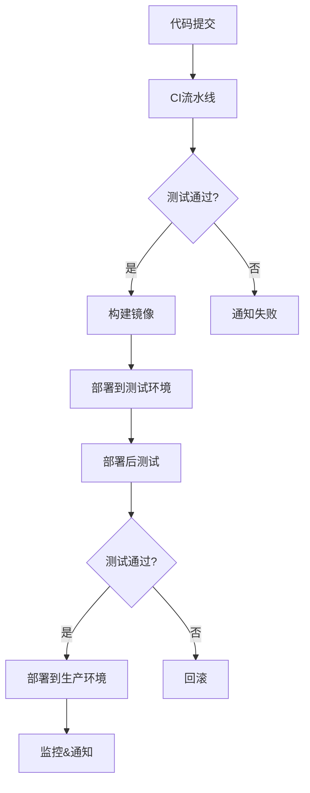

# CI/CD 流水线指南

本指南介绍DLMP项目的CI/CD流水线配置和使用方法。

## 📋 目录

- [概览](#概览)
- [CI流水线](#ci流水线)
- [CD流水线](#cd流水线)
- [发布流程](#发布流程)
- [环境配置](#环境配置)
- [故障排除](#故障排除)

## 🔍 概览

DLMP项目采用GitHub Actions实现完整的CI/CD流水线，包括：

- **持续集成 (CI)**: 代码质量检查、自动化测试、安全扫描
- **持续部署 (CD)**: 自动化部署到测试/生产环境
- **发布管理**: 版本发布、镜像构建、变更日志生成

### 流水线架构



## 🔄 CI流水线

### 触发条件

- 推送到 `main` 或 `develop` 分支
- 创建Pull Request到主分支
- 手动触发

### 流水线阶段

#### 1. 代码质量检查
```yaml
- ESLint代码规范检查
- Prettier格式检查  
- TypeScript类型检查
- SonarQube代码分析
```

#### 2. 前端测试
```yaml
- 单元测试 (Vitest)
- 组件测试 (React Testing Library)
- E2E测试 (Playwright)
- 覆盖率检查
```

#### 3. 后端测试
```yaml
- 单元测试 (JUnit)
- 集成测试 (Spring Boot Test)
- API测试
- 数据库测试
```

#### 4. 安全扫描
```yaml
- 依赖漏洞扫描 (Trivy)
- 许可证检查
- 敏感信息检测
```

#### 5. 构建&打包
```yaml
- 前端构建 (Vite)
- 后端构建 (Gradle)
- Docker镜像构建
- 构建产物上传
```

### 使用示例

```bash
# 触发CI流水线
git push origin feature/new-feature

# 查看流水线状态
gh workflow view ci.yml

# 手动触发
gh workflow run ci.yml
```

## 🚀 CD流水线

### 触发条件

- 推送到 `main` 分支 (自动部署到测试环境)
- 创建版本标签 (自动部署到生产环境)
- 手动触发部署

### 部署流程

#### 1. 预部署检查
```yaml
- 环境健康检查
- 依赖服务验证
- 权限检查
```

#### 2. 数据库迁移
```yaml
- 备份现有数据 (生产环境)
- 执行数据库迁移
- 验证迁移结果
```

#### 3. 应用部署
```yaml
- 蓝绿部署/滚动更新
- 健康检查
- 服务注册
```

#### 4. 部署后测试
```yaml
- 冒烟测试
- API集成测试
- 性能验证
- 监控检查
```

#### 5. 回滚机制
```yaml
- 自动回滚 (测试失败时)
- 手动回滚 (问题发现时)
- 数据恢复
```

### 环境配置

#### 测试环境 (Staging)
```yaml
Environment: staging
URL: https://staging.dlmp.com
Auto-deploy: main分支推送
Approval: 不需要
```

#### 生产环境 (Production)
```yaml
Environment: production  
URL: https://dlmp.com
Auto-deploy: 版本标签创建
Approval: 需要管理员批准
```

## 📦 发布流程

### 版本规范

采用语义化版本 (Semantic Versioning):
- `v1.0.0` - 主版本
- `v1.1.0` - 次版本 
- `v1.0.1` - 补丁版本
- `v1.0.0-beta.1` - 预发布版本

### 发布步骤

#### 1. 自动发布 (推荐)
```bash
# 创建并推送版本标签
git tag v1.0.0
git push origin v1.0.0

# 自动触发发布流水线
# - 构建发布包
# - 创建GitHub Release
# - 部署到生产环境
```

#### 2. 手动发布
```bash
# 通过GitHub Actions手动触发
gh workflow run release.yml -f version=v1.0.0 -f prerelease=false
```

### 发布内容

每个发布包包含：
- 前端静态文件 (`dlmp-frontend-v1.0.0.tar.gz`)
- 后端JAR文件 (`dlmp-backend-v1.0.0.jar`)
- Docker镜像 (多架构支持)
- 校验和文件 (SHA256)
- 变更日志 (自动生成)

### 发布验证

```bash
# 下载发布包
wget https://github.com/org/dlmp/releases/download/v1.0.0/dlmp-frontend-v1.0.0.tar.gz

# 验证校验和
sha256sum -c dlmp-frontend-v1.0.0.tar.gz.sha256

# 使用Docker镜像
docker pull dlmp/dlmp-frontend:v1.0.0
docker pull dlmp/dlmp-backend:v1.0.0
```

## ⚙️ 环境配置

### GitHub Secrets

在GitHub仓库设置中配置以下Secrets：

#### 容器镜像仓库
```bash
CONTAINER_REGISTRY=registry.example.com
REGISTRY_USERNAME=your-username
REGISTRY_PASSWORD=your-password
DOCKERHUB_USERNAME=your-dockerhub-username
DOCKERHUB_TOKEN=your-dockerhub-token
```

#### 数据库配置
```bash
DB_HOST=your-db-host
DB_USER=your-db-user
DB_PASSWORD=your-db-password
DB_URL=jdbc:mysql://host:3306/dbname
```

#### Kubernetes配置
```bash
KUBE_CONFIG=base64-encoded-kubeconfig
```

#### 通知配置
```bash
SLACK_WEBHOOK_URL=https://hooks.slack.com/...
NOTIFICATION_EMAIL=alerts@example.com
SMTP_SERVER=smtp.example.com
SMTP_USERNAME=smtp-user
SMTP_PASSWORD=smtp-pass
```

#### 监控配置
```bash
GRAFANA_URL=https://grafana.example.com
GRAFANA_TOKEN=your-grafana-token
SONAR_TOKEN=your-sonar-token
```

### 本地测试环境

#### 快速启动
```bash
# 运行环境设置脚本
./scripts/ci-setup.sh

# 启动测试环境
./scripts/start-test-env.sh

# 运行完整测试
./scripts/run-full-tests.sh

# 停止测试环境
./scripts/stop-test-env.sh
```

#### 服务访问地址
- **前端应用**: http://localhost:3000
- **后端API**: http://localhost:8080
- **数据库管理**: http://localhost:8081
- **监控面板**: http://localhost:3001
- **邮件测试**: http://localhost:8025

## 🔧 故障排除

### 常见问题

#### 1. CI测试失败
```bash
# 查看详细日志
gh run view --log

# 本地复现测试
npm test
npm run test:e2e

# 检查代码质量
npm run lint
npm run type-check
```

#### 2. 部署失败
```bash
# 检查Kubernetes资源
kubectl get pods -n dlmp-production
kubectl describe pod <pod-name> -n dlmp-production

# 查看应用日志
kubectl logs <pod-name> -n dlmp-production

# 检查服务健康
curl -f https://dlmp.com/health
curl -f https://api.dlmp.com/actuator/health
```

#### 3. Docker镜像构建失败
```bash
# 本地构建测试
docker build -t test-image ./frontend
docker build -t test-image ./backend

# 检查构建上下文大小
du -sh frontend/
du -sh backend/

# 清理Docker缓存
docker system prune -a
```

#### 4. 数据库迁移失败
```bash
# 检查迁移状态
cd backend
./gradlew flywayInfo

# 手动执行迁移
./gradlew flywayMigrate

# 修复迁移问题
./gradlew flywayRepair
```

### 监控和告警

#### 关键指标监控
- **构建成功率**: >95%
- **部署时间**: <10分钟
- **测试覆盖率**: >80%
- **部署成功率**: >99%

#### 告警通道
- **Slack**: #ci-cd, #deployments
- **邮件**: 关键错误和生产部署
- **短信**: 生产环境故障

### 性能优化建议

#### CI优化
```yaml
# 缓存依赖
- uses: actions/cache@v3
  with:
    path: ~/.npm
    key: npm-${{ hashFiles('package-lock.json') }}

# 并行执行
strategy:
  matrix:
    node-version: [18, 20]
```

#### CD优化
```yaml
# 蓝绿部署
- name: Blue-Green Deployment
  run: |
    kubectl set image deployment/app container=image:new
    kubectl rollout status deployment/app
```

## 📚 相关文档

- [GitHub Actions文档](https://docs.github.com/en/actions)
- [Docker最佳实践](https://docs.docker.com/develop/best-practices/)
- [Kubernetes部署指南](https://kubernetes.io/docs/concepts/workloads/controllers/deployment/)
- [Helm Chart开发](https://helm.sh/docs/chart_best_practices/)

## 🤝 贡献指南

1. Fork项目仓库
2. 创建功能分支 (`git checkout -b feature/amazing-feature`)
3. 提交更改 (`git commit -m 'Add amazing feature'`)
4. 推送到分支 (`git push origin feature/amazing-feature`)
5. 创建Pull Request

---

📝 **注意**: 本文档会随着CI/CD流水线的更新而持续维护。如有问题或建议，请创建Issue或联系团队。